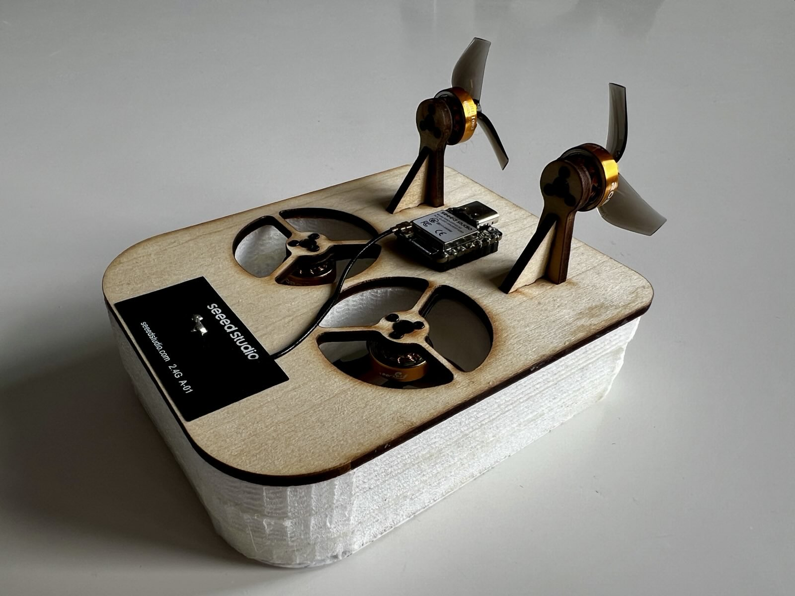

# µ-verCraft II

In this project we develloped a micro autonomous hovercraft with WiFi control, PID-stabilized yaw control, and autonomous navigation capabilities.

## Overview

µ-verCraft II is an ESP32-S3-based hovercraft designed to navigate autonomously along a predefined track in the ENSMM hall. The system uses IR sensors for line detection, a 10-DOF IMU for orientation, and implements real-time control using FreeRTOS.

## Features

- **WiFi-based remote control** via web interface (no app required)
- **PID yaw-rate stabilization** using complementary filter and magnetometer
- **Autonomous navigation mode** with IR line detection and position correction
- **Real-time telemetry** (battery voltage, current, capacity estimation)
- **DShot ESC protocol** for brushless motor control

## Hardware

- ESP32-S3 microcontroller
- 10-DOF IMU (ADXL345, ITG3205, QMC5883, BMP280)
- 4x brushless motors with ESCs
- IR sensors for line tracking
- LiPo battery monitoring system

## CAD

- The CAD was created in Creo10 and is provided

## Getting Started

1. Clone the repository
2. Open in VS Code with PlatformIO extension
3. Calibrate magnetometer using provided protocol
4. Connect to WiFi AP and access web interface for control

## Project Structure

- `src/main.cpp` - Main entry point with FreeRTOS task setup
- `src/hovercraft_variables.*` - Global configuration and pin definitions
- Motor control, IMU, PID, battery monitoring, and WiFi modules

---

**ENSMM/Supmicrotech - Project PIST 2025/26 - Leon VOLLES & Luis GÖBES**
